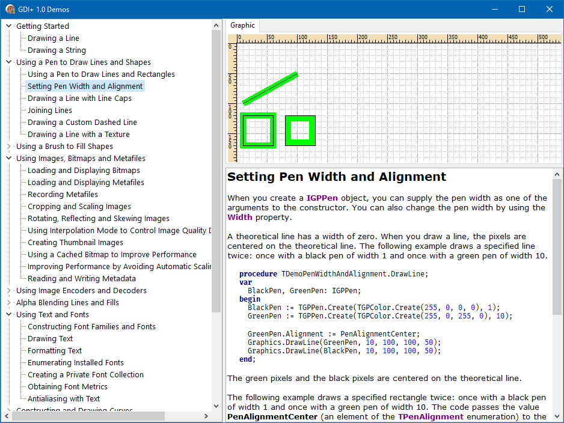
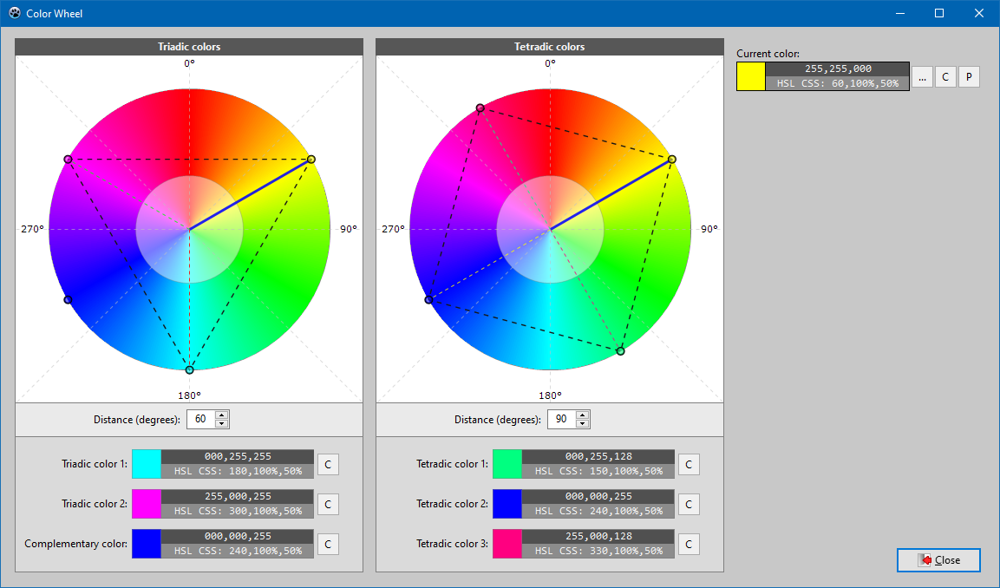

# GDI+ Library for Delphi and Lazarus

The **Delphi 2009 GDI+ Library** ported to Lazarus.

<!-- Start Document Outline -->

- [GDI+ Library for Delphi and Lazarus](#gdi-library-for-delphi-and-lazarus)
  - [Delphi 2009 GDI+ Library](#delphi-2009-gdi-library)
  - [Original license](#original-license)
  - [License for my modifications](#license-for-my-modifications)
  - [My modifications](#my-modifications)
  - [Screenshots](#screenshots)
  - [Installation](#installation)
    - [Delphi](#delphi)
    - [Lazarus](#lazarus)
  - [Changelog](#changelog)

<!-- End Document Outline -->

---

## Delphi 2009 GDI+ Library

This library enables GDI+ functionality for Delphi 2009 and later.

Author: Erik van Bilsen  
Home page: http://www.bilsen.com/gdiplus/index.shtml

A quote from the author's website:

This library enables GDI+ functionality for Delphi 2009 and later. It differs from other Delphi GDI+ libraries in the following ways:

- It is modeled more after the .NET System.Drawing namespace instead of the C++ GDI+ classes. As a result, this library is a bit more **high level** and easier to use.
- It uses **object interfaces** for automatic memory management and ease of use. You don't have to keep track of your graphics objects anymore.
- It uses **exceptions** instead of error codes to handle errors the Delphi way.
- It comes with sample applications that demonstrate the usage of GDI+ through examples from the Windows Platform SDK.
- It supports the **GDI+ version 1.1** extensions that were added with Windows Vista and certain Office versions.
- Optionally provides class helpers for interoperability with Delphi's TBitmap and TCanvas.

Note that this GDI+ library only works with Delphi 2009 or later. This is because the library uses some new features of Delphi 2009 such as generics, and assumes that all string functions use Unicode strings.

---

## Original license

Delphi GDI+ Library for use with Delphi 2009 or later.
Copyright (C) 2009 by Erik van Bilsen.
Email: erik(at)bilsen. com
Website: http://www.bilsen.com/gdiplus

License in plain English:

1. I don't promise that this software works. (But if you find any bugs,
   please let me know!)
2. You can use this software for whatever you want. You don't have to pay me.
3. You may not pretend that you wrote this software. If you use it in a program,
   you must acknowledge somewhere in your documentation that you've used this
   code.

In legalese:

The author makes NO WARRANTY or representation, either express or implied,
with respect to this software, its quality, accuracy, merchantability, or
fitness for a particular purpose.  This software is provided "AS IS", and you,
its user, assume the entire risk as to its quality and accuracy.

Permission is hereby granted to use, copy, modify, and distribute this
software (or portions thereof) for any purpose, without fee, subject to these
conditions:  
(1) If any part of the source code for this software is distributed, then the
License.txt file must be included, with this copyright and no-warranty notice
unaltered; and any additions, deletions, or changes to the original files
must be clearly indicated in accompanying documentation.  
(2) If only executable code is distributed, then the accompanying
documentation must state that "this software is based in part on the Delphi
GDI+ library by Erik van Bilsen".  
(3) Permission for use of this software is granted only if the user accepts
full responsibility for any undesirable consequences; the author accepts
NO LIABILITY for damages of any kind.

---

## License for my modifications

Public domain - You can do with my code whatever you want without any limitations.

---

## My modifications

- Lazarus / Free Pascal support.  
Required **FPC version 3.2.0 or newer!**.
- A few helper routines in the `GdiPlusHelpers.pas` file.
- New files: `GdiPlus_DCC.inc`, `GdiPlus_FPC.inc`.
- Minor changes to the demo programs (increased font size)
- New demo: Color Wheel
- Package for Lazarus.
- **GDI+ 1.1 extensions enabled by default**  
  In the original version of the GdiPlus unit, Erik turned off GDI+ 1.1 by default.
  To enable GDI+ 1.1 it was necessary to add the `GDIP_0110` to the conditional defines in the project options. This unit was written many years ago when Windows XP was widely used, so it made sense. Currently Windows XP is slowly becoming an "antique" system, so I decided to enable GDI+ 1.1 by default. However, if you want to be compatible with Windows XP, add `GDIP_XP_COMPAT` to conditional defines in your project.  

---

## Screenshots

Original demo application compiled with Delphi Rio.

---

Additional demo - Color Wheel - compiled with Lazarus 2.0.11 + FPC 3.2.0.

---

## Installation

### Delphi

No packages for Delphi. In the IDE options, add to the **Library path** directory with the `GdiPlus.pas` file.

### Lazarus

Build and install the `packages\Lazarus\lazgdiplus.lpk` package.

Open/create some project. In the **Project Inspector** add `LazGDIPlus` to **Required Packages**.

---

## Changelog

**16.05.2022**  
* GPFontList - Global list of GDI+ compatible fonts
* SetGPPenStyle - Set IGPPen style from TenStyle
* GetGPFontName - Get the first GDI+ compatible font name from the given array
* TransparencyToAlpha
* HatchStyleToStrID
* TryStrIDToHatchStyle

**23.09.2020**  
Initial commit with the Free Pascal / Lazarus support.
